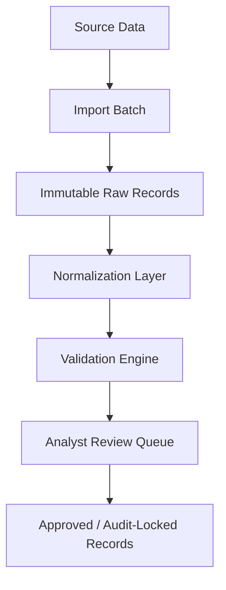

# Breathe ESG Data Ingestion Platform

## Overview
This is a full-stack platform designed for operational ESG data review and audit workflows built for Breathe ESG. The system uses an audit-first approach to ingest heterogeneous source data, normalize it into a canonical schema while preserving original source provenance, and provide an analyst-centric workflow for validation and audit-locked record approval.

## Architectural Principles
- **Preserve original source data without mutation:** Raw imported records are immutable and preserved for audit traceability.
- **Normalize heterogeneous operational data:** Convert diverse inputs into a canonical ESG activity schema.
- **Separate ingestion, validation, review, and audit concerns:** Ensure a clean, domain-driven boundary between responsibilities.
- **Prioritize analyst reviewability and traceability:** Make it easy for domain experts to trace any canonical record back to its exact source row.
- **Keep workflows explainable and operationally realistic:** Avoid over-engineering in favor of reliable, auditable operations.

## Technology Stack
- **Backend:** Django, Django REST Framework, PostgreSQL
- **Frontend:** React (Vite), TypeScript, Tailwind CSS, React Query
- **Architecture:** Modular, Domain-Oriented Django Apps (`core`, `tenants`, `imports`, `sap`, `utilities`, `travel`, `records`, `validation`, `reviews`, `audit`)

## Key Features
- **Heterogeneous Data Ingestion:** Process operational data natively from varied systems.
- **Normalization & Provenance:** Normalize incoming data to a canonical schema while strictly maintaining source provenance.
- **Audit-First Design:** Complete audit trails for every state change.
- **Analyst Workflow:** Dedicated interfaces for analysts to review anomalies, validate data, and approve records.
- **Multi-tenancy Support:** Isolated tenant boundaries for separate corporate entities or reporting units.

## Data Flow Architecture

- **Source Data:** Exports and API pulls from enterprise systems.
- **Immutable Raw Records:** Raw imported records are immutable and preserved for audit traceability. Stored exactly as received.
- **Normalization Layer:** Transforms diverse raw records into canonical ESG activity records.
- **Validation Engine:** Applies business rules to generate analyst-reviewable issues for anomalies or missing data.
- **Analyst Review Queue:** Workflow state where human analysts verify and correct data context.
- **Audit-Locked Records:** Once approved, records become immutable and form the basis of reporting.

## Analyst Review Interface
The frontend provides a purpose-built operational UI designed specifically for audit workflows:
- **Comprehensive Record Details:** Analysts can view the final normalized record side-by-side with the immutable raw JSON payload, ensuring 100% provenance visibility.
- **Explicit Validation Severities:** Anomalies are flagged with explicit severities (`HIGH`, `MEDIUM`, `LOW`) and human-readable context to guide reviewer decisions.
- **Visual Audit Timeline:** Every record displays a sequential timeline (e.g., Imported → Flagged → Analyst Reviewed → Audit Locked).
- **Audit Lock Workflow:** Approved records can be explicitly "Locked". This enforces governance by disabling edits, appending an audit timestamp, and displaying a lock badge across the system.
- **Detailed Ingestion History:** The Upload Center provides drill-down drawers for every batch, exposing success/failure metrics, parser versions, and source ingestion methods.

## Supported Source Types
- **SAP Exports:**
  - CSV-based fuel and procurement exports.
  - Handles German field names, plant codes, and inconsistent units.
- **Utility Electricity Data:**
  - Utility portal CSV exports.
  - Supports billing periods and meter-based consumption records.
- **Corporate Travel Data:**
  - Mock Concur/Navan-style API ingestion.
  - Supports flights, hotels, and ground transport.

## Project Structure
- `/backend`: Main Django project configuration.
- `/core`: Common utilities, base models, and shared logic.
- `/tenants`: Multi-tenancy isolation and management.
- `/imports`: Orchestrates data import batches and parsing.
- `/sap`: Domain logic for SAP source ingestion and parsing.
- `/utilities`: Domain logic for utility bill ingestion.
- `/travel`: Domain logic for corporate travel ingestion.
- `/records`: Core data models for canonical, normalized ESG records.
- `/validation`: Business rules and anomaly detection engine.
- `/reviews`: State machine and workflow for analyst review.
- `/audit`: Strict audit logging system tracking all mutations.
- `/frontend`: React-based single-page application (Vite) for the analyst interface.

## Getting Started

### Prerequisites
- Python 3.10+
- Node.js 18+
- PostgreSQL

### Backend Setup
1. Navigate to the project root.
2. Create and activate a virtual environment:
   ```bash
   python -m venv venv
   # On Windows:
   .\venv\Scripts\activate
   # On macOS/Linux:
   source venv/bin/activate
   ```
3. Install dependencies:
   ```bash
   pip install -r requirements.txt
   ```
4. Set up your PostgreSQL database and configure the connection parameters in your environment or `.env` file.
5. Run migrations to initialize the database schema:
   ```bash
   python manage.py migrate
   ```
6. Start the Django development server:
   ```bash
   python manage.py runserver
   ```

### Frontend Setup
1. Navigate to the frontend directory:
   ```bash
   cd frontend
   ```
2. Install npm dependencies:
   ```bash
   npm install
   ```
3. Start the Vite development server:
   ```bash
   npm run dev
   ```
## Screenshot

### Dashboard


### Upload Center


### Review Queue


